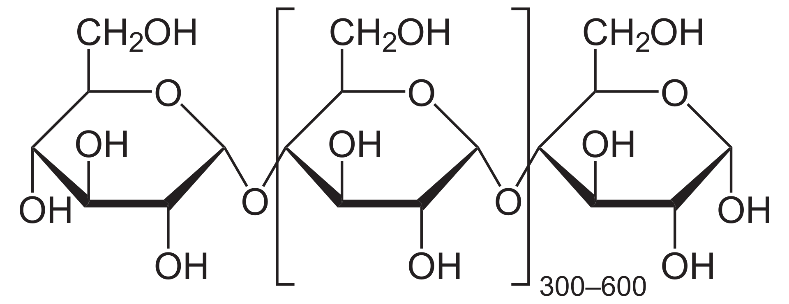

---
tags:
  - starch
  - natural polymers
---

# Starch

Starch or amylum is a polymeric carbohydrate consisting of numerous glucose units joined by glycosidic bonds. This polysaccharide is produced by most green plants for energy storage. It is the most common carbohydrate in human diets and is contained in large amounts in staple foods like potatoes, maize (corn), rice, wheat and cassava (manioc).

## Structure

Structure of Starch

## Characteritics

Pure starch is a white, tasteless and odorless powder that is insoluble in cold water or alcohol. It consists of two types of molecules: the linear and helical amylose and the branched amylopectin. These molecules are deposited as granules of different sizes and shapes with semi-crystalline and amorphous concentric layers that show the ‘maltese cross’. Amylose is a much smaller molecule than amylopectin. Starches from different sources show variable chemical composition as well as the structure of their components that are involved in thermal properties. Amylose, lipids, phosphorylated residues and long lateral chain amylopectin interact among them avoiding water uptake. In contrast, high amylopectin contents, especially with short lateral chains, allow hydration via hydrogen bonds to form gels with the tendency to retrogradation.

## Use

